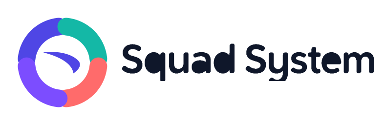
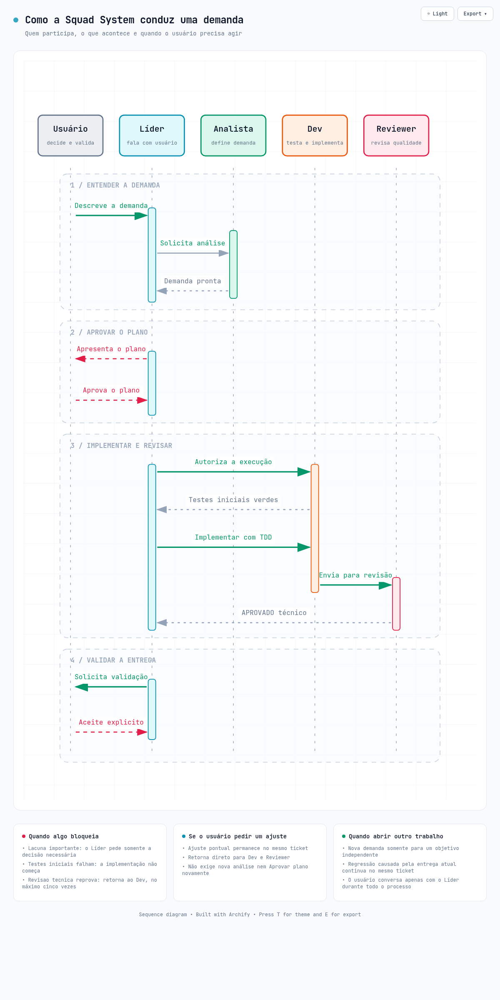

<p align="center">
  
</p>

Instala uma Squad de Chão de Fábrica em projetos existentes para **Kiro**, **Codex** ou ambos.

O usuário conversa com o agente que já está usando. O agente inspeciona o projeto, integra semanticamente o `AGENTS.md` e executa a instalação. A CLI cuida das operações determinísticas: escrita transacional, propriedade, diagnóstico e desinstalação.

## MVP

- quatro papéis: líder, analista, dev e reviewer;
- instalação Kiro e Codex;
- contexto detalhado obrigatório;
- arquitetura opcional, com fallback para `arquitetura-proposta`;
- preservação do `AGENTS.md` existente;
- instalação idempotente;
- respostas curtas e orientadas à decisão;
- ajustes da mesma entrega sem reiniciar a demanda;
- contrato operacional completo em `AGENTS.md`;
- papéis canônicos em `.agent/subagents/`, projetados para Kiro e Codex;
- diagnóstico e desinstalação segura;
- nenhuma leitura de `.env` ou secrets.

## Uso prático da squad

Depois da instalação, continue conversando com o agente que você já está usando. Descreva a necessidade, o resultado esperado e qualquer restrição relevante; ele atua como `service-lider`, o ponto único de contato, e conduz os demais papéis. Você não precisa conhecer nem executar comandos internos de subagentes.

Uma boa abertura é direta:

> Corrija a duplicação de cobranças ao repetir uma requisição. O contrato atual da API deve ser preservado.

Se faltar uma decisão com impacto real, o líder pedirá somente a informação necessária. Para pedidos de implementação, nenhuma alteração começa antes de um plano apresentado e de sua aprovação explícita.

### Papéis, limites e entregas

| Papel | Responsabilidade | Limite | Resultado esperado |
|---|---|---|---|
| `service-lider` | Orquestra o fluxo, mantém a comunicação com o usuário e encaminha o trabalho aos outros papéis. | Não escreve código, ticket ou revisão. | Próximo passo claro, pedido de decisão quando necessário e estado atualizado da demanda. |
| `service-analista` | Classifica a demanda e valida ou registra objetivo, escopo, critérios de aceite, impacto e lacunas. | Não implementa código; ajuste pontual da entrega não reinicia a análise. | Ticket pronto para decisão ou lacunas bloqueantes objetivas. |
| `service-dev` | Implementa somente demanda aprovada, com TDD, arquitetura configurada e princípios de software. | Para se os testes iniciais revelarem uma base previamente vermelha; não remove nem afrouxa testes para esconder falhas. | Alteração protegida por testes e evidências da suíte executada. |
| `service-reviewer` | Revisa aderência ao ticket, arquitetura, princípios, segurança aplicável e qualidade dos testes. | Não altera código; pode reprovar por até cinco rodadas, sempre com correção acionável. | Veredito `APROVADO` ou `REPROVADO`; quando aprovado, encaminhamento para validação do usuário. |

As fontes canônicas desse comportamento são o contrato em `AGENTS.md` e as definições em `.agent/subagents/`.

### Workflow, gates e ações do usuário

1. **Abertura e classificação:** você descreve a demanda ao `service-lider`. O `service-analista` classifica o trabalho e verifica se objetivo, escopo e critérios estão completos. Se houver lacuna material, você fornece a decisão ou informação solicitada.
2. **Plano e aprovação:** em evolução, nova funcionalidade ou outra implementação que exija plano, o líder apresenta uma síntese do plano. O primeiro gate é sua **aprovação explícita**; responder, por exemplo, “Aprovo o plano” autoriza a primeira alteração.
3. **Testes iniciais:** o `service-dev` executa a suíte configurada antes de editar. Uma base previamente vermelha bloqueia a mudança: você recebe a falha, o impacto e a ação necessária para decidir como prosseguir.
4. **Implementação com TDD:** o dev cria um teste que falha pelo comportamento ausente ou incorreto, implementa apenas o escopo aprovado e executa os testes relevantes e a suíte completa.
5. **Revisão técnica:** o `service-reviewer` verifica ticket, arquitetura, princípios e testes. Somente um veredito `REPROVADO` consome uma das cinco rodadas do ticket. A quinta reprovação acumulada interrompe o ciclo e exige escalonamento objetivo, mesmo quando ocorre após retorno da validação.
6. **Validação:** após `APROVADO`, o estado muda para `aguardando-validacao`. `APROVADO`, espera, feedback, validação e aceite não consomem nem reiniciam o contador. A aprovação técnica não conclui a demanda: você valida o resultado e dá o **aceite explícito** ou registra um feedback concreto.
7. **Ajustes ou conclusão:** um ajuste pontual muda o estado para `em-ajuste`, permanece no **mesmo ticket**, preserva as reprovações acumuladas e retorna diretamente a dev e reviewer, sem nova triagem, novo plano ou nova aprovação. Uma regressão causada pela entrega segue a mesma regra. Um objetivo independente exige **nova demanda**, com contador próprio. Somente seu aceite explícito muda o trabalho para `concluida`.

Em resumo, as ações esperadas do usuário ficam concentradas nos gates de informação faltante, aprovação do plano e validação final. Os gates de testes e revisão são executados pela squad, com escalonamento apenas quando existir bloqueio ou escolha relevante.

<p align="center">
  
</p>

<p align="center"><sub><a href="documentacao/diagramas/jornada-agentes-squad-system.html">Baixe o HTML e abra-o localmente</a> para usar temas e opções de exportação.</sub></p>

### Exemplos de interação

**Melhoria com implementação**

> Usuário: “Inclua filtro por status na listagem, preservando clientes atuais.”  
> Líder: “Demanda pronta. O plano altera o caso de uso, o adaptador de entrada e os testes. Aprova?”  
> Usuário: “Aprovo o plano.”  
> Líder, depois da implementação e revisão: “Aprovado tecnicamente; status `aguardando-validacao`. Valide o filtro.”  
> Usuário: “Validado, aceito a entrega.”

**Ajuste durante a validação**

> Usuário: “O filtro funciona, mas o valor vazio deve listar todos.”  
> Líder: “Ajuste pontual registrado no mesmo ticket; seguirá para dev e reviewer.”

**Novo objetivo**

> Usuário: “Além disso, quero exportar a listagem em CSV.”  
> Líder: “Esse é um objetivo independente e será tratado em uma nova demanda.”

### Registro dos trabalhos em `documentacao/`

O diretório `documentacao/` é o acervo dos trabalhos realizados pela squad. Os tickets em `documentacao/ticket/{demanda}/{codigo}.md` registram escopo, critérios, plano, rodadas de revisão e validação. Consulte e pesquise esse conteúdo para reconstruir a pesquisa histórica das mudanças do projeto, entender por que uma decisão foi tomada e localizar entregas relacionadas antes de abrir ou analisar uma demanda.

## Uso pelo agente

Requer Node.js 18 ou superior. Para desenvolvimento e publicação, o projeto usa Node.js 22.

```bash
npx @joleques/squad-system inspect --path /caminho/do/projeto
npx @joleques/squad-system init --path /caminho/do/projeto --spec /tmp/install-spec.json
npx @joleques/squad-system doctor --path /caminho/do/projeto
```

O `install-spec.json` é preparado pelo agente após ler o diagnóstico, a documentação e o código relevante:

```json
{
  "name": "checkout-api",
  "description": "Descrição detalhada do produto e do papel deste projeto.",
  "purpose": "Problema que o projeto resolve.",
  "users": "Usuários e operadores.",
  "domain": "Linguagem e capacidades do domínio.",
  "stack": "typescript-node",
  "testCommand": "npm test",
  "stage": "MVP em desenvolvimento",
  "tools": ["kiro", "codex"]
}
```

Para visualizar as mudanças:

```bash
npx @joleques/squad-system init --spec /tmp/install-spec.json --dry-run
```

## Integração do AGENTS.md

Se o arquivo não existir, a squad cria o padrão. Se existir, o agente deve analisar conflitos e pode fornecer `agentsIntegration` no spec. A seção da squad fica entre marcadores gerenciados, permitindo reinstalação sem duplicação.

## Diagnóstico e remoção

```bash
npx @joleques/squad-system doctor
npx @joleques/squad-system uninstall --dry-run
npx @joleques/squad-system uninstall
```

A remoção restaura arquivos anteriores quando possível. Arquivos gerenciados que tenham sido modificados pelo usuário são preservados.

## Arquitetura interna

O código segue o padrão `arquitetura-proposta`:

```text
src/
├── domain/       # contratos e regras puras da instalação
├── use_case/     # instalação, diagnóstico, inspeção e remoção
├── application/  # CLI, argumentos e composition root
├── infra/        # filesystem, templates e emissores Kiro/Codex
└── shared/       # constantes e hash compartilhados
```

As dependências apontam para dentro. Os casos de uso recebem filesystem, templates e emissores por injeção; somente o `composition-root` conhece simultaneamente casos de uso e infraestrutura. O teste `tests/architecture/dependency-rule.test.js` protege essa regra.

## Publicação

Cada versão publicada no npm é imutável. A publicação é feita pelo GitHub Actions quando uma tag estritamente SemVer (`vX.Y.Z`) corresponde à versão do `package.json`.

Antes do primeiro release, configure um Trusted Publisher no pacote `@joleques/squad-system` no npm:

- provider: GitHub Actions;
- organization or user: `joleques`;
- repository: `squad-system`;
- workflow filename: `publish.yml`;
- allowed action: `npm publish`.

O fluxo usa OIDC e não requer `NPM_TOKEN`. Para preparar e enviar um release, a árvore Git deve estar limpa e o remote `origin` configurado:

```bash
nvm use
make test
make pack
make release-patch # ou release-minor / release-major
```

O comando de release executa os gates locais, usa `npm version` para criar commit e tag e envia ambos atomicamente. O workflow repete instalação determinística, testes e validação do pacote antes de publicar.

## Fora do MVP

- Claude e Cursor;
- Jira obrigatório;
